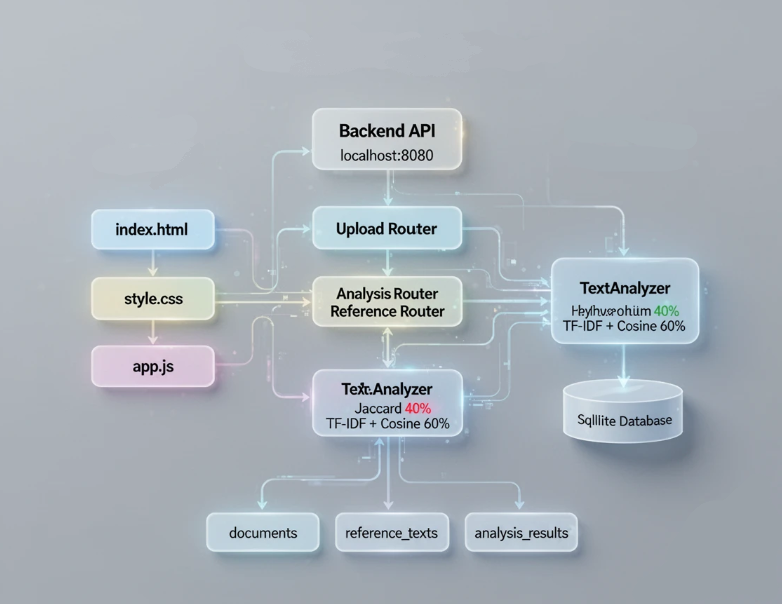
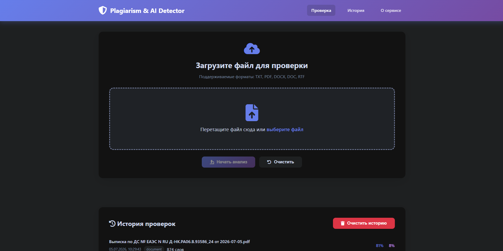
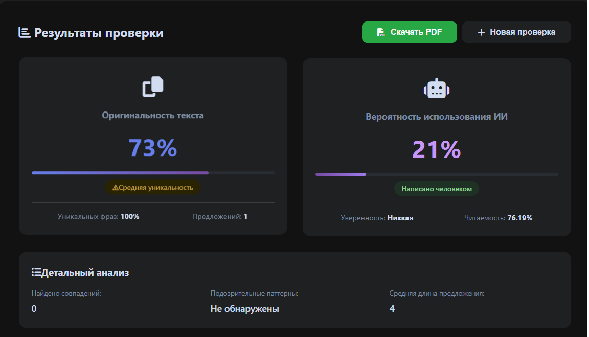
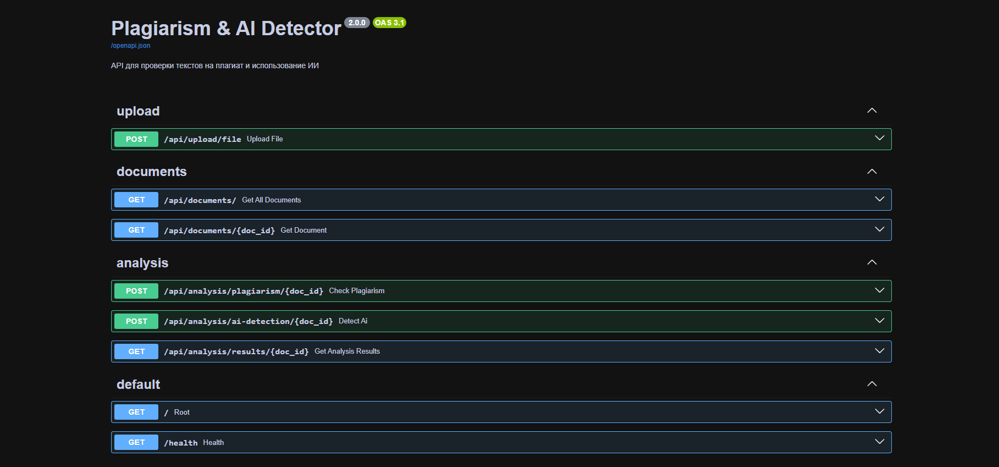

# Plagiarism & AI Detector

**Современный веб-сервис для проверки текстов на плагиат и обнаружения контента, созданного искусственным интеллектом**

[Демо](#) • [Документация](#) • [Установка](#) • [Контакты](#)

---

## О проекте

**Plagiarism & AI Detector** — это веб-приложение, которое позволяет:

- Загружать документы (TXT, PDF, DOCX, DOC, RTF)
- Проверять текст на плагиат
- Обнаруживать контент, созданный ИИ
- Получать детальный анализ
- Сохранять историю проверок

---

## Ключевые функции

### Гибридный анализ плагиата
- **Jaccard Index (40%)** — находит буквальные совпадения
- **TF-IDF + Cosine Similarity (60%)** — находит смысловые совпадения
- **Гибридный результат** — максимальная точность

### Обнаружение ИИ
- Анализ разнообразия словаря
- Проверка длины предложений
- Поиск паттернов ИИ
- Индекс читаемости Флеша

### Детальные отчеты
- Процент уникальности
- Вероятность ИИ
- Список совпадений
- Рекомендации

---

## Технологии

### Бэкенд
- **FastAPI** — веб-фреймворк
- **SQLAlchemy** — ORM для работы с БД
- **SQLite** — база данных
- **Scikit-learn** — TF-IDF и машинное обучение
- **PyPDF2, python-docx** — извлечение текста

### Фронтенд
- **HTML5 + CSS3** — интерфейс
- **JavaScript (ES6)** — логика
- **Font Awesome** — иконки

---

## Архитектура

---

## Скриншоты

### Главная страница

### Результаты анализа

### API Документация (Swagger)

